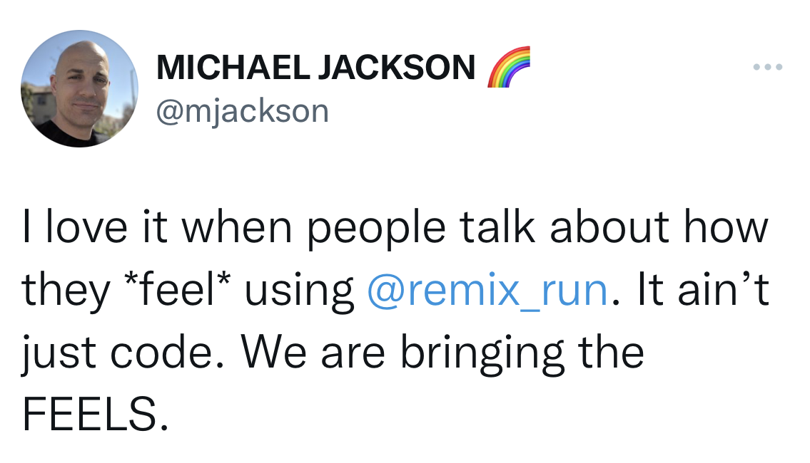

# **Remix presentation beta.gouv.fr**
---
# **C'est quoi Remix ?**
> Remix est un framework full stack basé sur les fondements de la plateforme web.
---


---
# React Router v6
```tsx
<Routes>
  <Route element={<RootRoute />}>
    <Route index element={<IndexRoute />} />
    <Route path="signin" element={<SignInRoute />} />
    <Route path="signout" element={<SignOutRoute />} />
    <Route path="todos" element={<TodosRoute />}>
      <Route index element={<TodosIndexRoute />} />
      <Route path="$id" element={<TodosIdRoute />} />
    </Route>
  </Route>
</Routes>
```
---
# React Router v6 + Remix
```tsx
<Routes>
  <Route file="root.tsx">
    <Route index file="routes/index.tsx" />
    <Route path="signin" file="routes/signin.tsx" />
    <Route path="signout" file="routes/signout.tsx" />
    <Route path="todos" file="routes/todos.tsx">
      <Route index file="routes/todos/index.tsx" />
      <Route path="$id" file="routes/todos/$id.tsx" />
    </Route>
  </Route>
</Routes>
```
---
# **Backend**
---
## RouteModule
```ts
export interface RouteModule {
  handle?: RouteHandle;
  links?: LinksFunction;
  meta?: MetaFunction | HtmlMetaDescriptor;
  headers?: HeadersFunction | { [name: string]: string };

  CatchBoundary?: CatchBoundaryComponent;
  ErrorBoundary?: ErrorBoundaryComponent;

  loader?: LoaderFunction;
  action?: ActionFunction;
  default: RouteComponent;
}
```
---
## Links
```ts
export const links = () => [
  {
    rel: 'stylesheet',
    href: '/index.css'
  },
  {
    rel: 'apple-touch-icon',
    sizes: '180x180',
    href: '/apple-touch-icon.png',
  },
  {
    rel: 'icon',
    type: 'image/png',
    sizes: '32x32',
    href: '/favicon-32x32.png',
  }
];
```
---
## Meta
```ts
export const meta = ({ data }) => ({
  title: `My Beautiful Website | ${data.title}`,
  description: 'A good description'
});
```
---
## Fetch API
```ts
const response = await fetch('https://my.api.com', {
  headers: { accept: 'application/json' }
});

response // type Response

const request = new Request('https://my.api.com', {
  headers: { accept: 'application/json' }
});

request // type Request

await fetch(request);
```
---
## Data Function
```ts
({ request, params }) => Promise<Response>;
```
<br>

* **Loader Function**: *GET* requests
* **Action Function**: *POST* / *PUT* / *PATCH* / *DELETE* requests
---
## Loader

```ts
export const loader: LoaderFunction = async ({ params }) => {
  const todo = await getTodo(params.id);

  return new Response(JSON.stringify(todo), {
    headers: { 'content-type': 'application/json' }
  })
};
```
---
## Loader + json
```ts
export const loader: LoaderFunction = async ({ params }) => {
  return getTodo(params.id);
};
```
---
## Loader + query params
```ts
import { json } from 'remix';

export const loader: LoaderFunction = async ({ request }) => {
  const url = new URL(request.url);
  const term = url.searchParams.get('term');

  const todos = await searchTodos(term);

  return json(todos);
};
```
---
## Loader + fetch
```ts
export const loader: LoaderFunction = async ({ request }) => {
  return fetch('https://my.api.com', {
    headers: request.headers
  });
};
```
---
## Action
```ts
import { redirect } from 'remix';

export const action: LoaderFunction = async ({ request, params }) => {
  const body = await request.formData();
  const firstName = body.get('firstName');

  await updateProfile(params.id, { firstName });

  return redirect(`/profile/${id}`);
};
```
---
## Action + json
```ts
import { json } from 'remix';

export const action: LoaderFunction = async ({ request }) => {
  const body = await request.json();
  const { firstName } = body;

  const profile = await createProfile({ firstName });

  return json(profile, {
    status: 201,
    headers: { location: `/profile/${profile.id}` }
  });
};
```
---
# **Frontend**
---
## Server Side Rendering
```tsx
import { renderToString } from 'react-dom/server';

function handleRequest(
  request,
  responseStatusCode,
  responseHeaders
) {
  const markup = renderToString(<RemixServer url={request.url} />);

  responseHeaders.set('content-type', 'text/html');

  return new Response('<!DOCTYPE html>' + markup, {
    status: responseStatusCode,
    headers: responseHeaders,
  });
}
```
---
## Client Side Rendering
```tsx
import { hydrate } from 'react-dom';

hydrate(<RemixBrowser />, document);
```
---
## Document
```tsx
function Document({ children }) {
  const includeScripts = useMatches()
    .some(({ handle }) => handle?.hydrate);

  return (
    <html lang="en">
      <head>
        <Meta />
        <Links />
      </head>
      <body>
        {children}
        <ScrollRestoration />
        {includeScripts ? <Scripts /> : null}
        <LiveReload />
      </body>
    </html>
  );
}
```
---
## ErrorBoundary
```tsx
export function ErrorBoundary({ error }) {
  return <Document>
    <h1>500</h1>
    <p>{error.message}</p>
  </Document>;
}
```
## CatchBoundary
```tsx
export function CatchBoundary() {
  const caught = useCatch();

  return <Document>
    <h1>{caught.status}</h1>
    <p>{caught.statusText}</p>
  </Document>;
}
```
---
## Route
```tsx
export default IndexRoute() {
  return <div>Hello World!</div>;
}
```
---
## Route + loader
```tsx
export const loader = () => ({ message: 'Hello World!' });

export default IndexRoute() {
  const data = useLoaderData();

  return <div>{data.message}</div>;
}
```
---
## Handle
```ts
export const handle = { hydrate: true };
```
## useMatches
```ts
const includeScripts = useMatches()
  .some(({ handle }) => handle?.hydrate);
```
---
# **Mutations**
---
## HTML Form
```tsx
function MyForm({ firstName }) {
  return <form action="/profile">
    <label htmlFor="firstName">First Name</label>
    <input
      id="firstName"
      name="firstName"
      defaultValue={firstName}
    />
    <button type="submit">Save</button>
  </form>;
}
```
---
## Remix Form
```tsx
function MyForm({ firstName }) {
  return <Form action="/profile" replace>
    <label htmlFor="firstName">First Name</label>
    <input
      id="firstName"
      name="firstName"
      defaultValue={firstName}
    />
    <button type="submit">Save</button>
  </Form>;
}
```
---
## Remix Optimistic Form
```tsx
function MyForm({ firstName }) {
  const transition = useTransition();
  const disabled = transition.state == 'submitting';
  const optimisticFirstName = transition
    .submission?.formData.get('firstName');

  return <>
    <p>{optimisticFirstName ?? firstName}</p>
    <Form action="/profile" replace>
      <label htmlFor="firstName">First Name</label>
      <input
        id="firstName"
        name="firstName"
        disabled={disabled}
        defaultValue={firstName}
      />
      <button disabled={disabled} type="submit">Save</button>
    </Form>
  </>;
}
```
---
# **Questions ?**
---
# **Liens utiles**

[Remix](https://remix.run)
[Remix Auth](https://github.com/sergiodxa/remix-auth)
[Remix Guide](https://remix.guide)

[Remix + GraphQL](https://github.com/tchak/remix-graphql-example)
[Demo](https://github.com/tchak/remix-presentation-beta)
